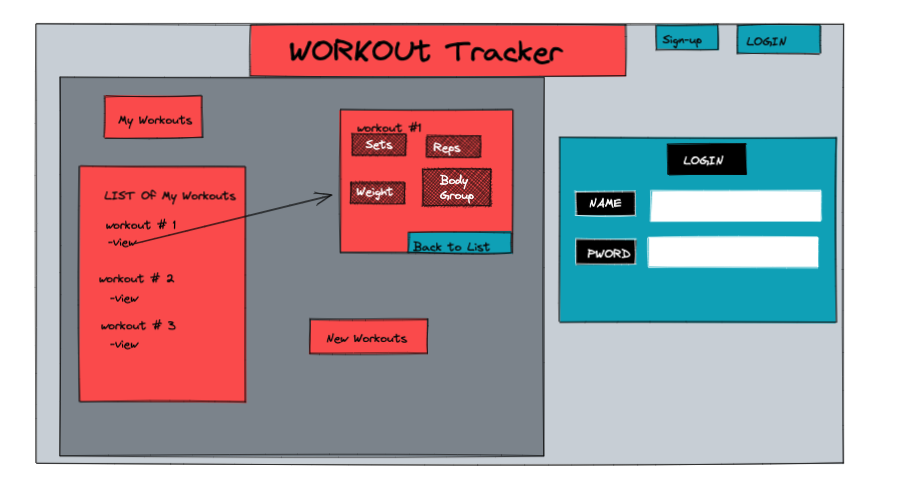

# Project 2 - Workout Tracker

## Purpose
To allow users to add and track multiple workout days and exercises.

## Technologies Used
- node.js, PostgreSQL, Sequelize, JS, EJS, CSS
- passport, passport-local, flash: authentification and messages on authentification
- dotenv: hold session secret and api keys
- express, express-session, express-ejs-layouts: routing and layout for EJS
- fetch: getting data from APIs
- request, cheerio: web scraping
- method-override: get and post route override (put and delete)
- heroku: deploy site

## Installation Instructions
1. go to GIT REPOSITORY LINK HERE
2. fork and clone the repository
    - image of fork
    - img of link
    - git clone REPOSITORY
3. install all node packages
    - npm i
4. create the database
    - createdb -U <username> workout_tracker
5. confirm database name is the same in the config/config.json
6. if on MAC, remove all <username> and <password> entities in the config.json
6. if on WINDOWS or LINUX, change <username> and <password> entries to the username and password of your database
7. migrate the models to the database
    - sequelize db:migrate
8. add a .env file with the following field: 
    - SESSION_SECRET: Can be any random string; usually a hash in production
9. run the server!
    - nodemon
    - node server.js

## Heroku Initialization
1. Get heroku account
2. If MAC: ```brew tap heroku/brew && brew install heroku```
2. If WINDOWS or LINUX: install heroku graphically
3. ```heroku login```
4. Make sure you're using ```app.listen(process.env.PORT || 3000)``` 
5. ```touch Procfile``` (make sure it's capitalized)
6. In ```Procfile``` add ```web: node server.js``` and save the Procfile
7. Provide access to the ```sequelize-cli```
    - if it's not in package.json ```npm i sequelize-cli```
    - heroku will create it's own node modules folder
8. Host the app with ```heroku app:create imjchiang-lolinfo```
9. Check for heroku with ```git remote - v``` and commit to github with add, commit, push
10. ```git push heroku master```
    - check for errors with ```heroku logs```
11. Set up the database with heroku
    - ```heroku config:set SECRET_SESSION="SECRET-SESSION-KEY-HERE"```
    - Add everything in ```.env``` to heroku through this method
12. Create your database
    - install Postgres on heroku with ```heroku addons:create heroku-postgresql:hobby-dev```
    - Check for db with ```heroku config```
    - Set up production settings in ```config.json```
    - add ```"use_env_variable": "DATABASE_URL"```
    - git add, commit, push to github first, then ```git push heroku master```
    - migrate the database with ```heroku run sequelize db:migrate```
13. Test your website by creating a new user
    - Open your app with ```heroku open```
    - Alternatively, the url will be using the name you gave your app in the url like so: https://workout-tracker-bydev-v2.herokuapp.com/


## Planning

### ERD


### Wireframes

## Code Snippet Examples
```javascript
router.get('/', function (req, res) {
    console.log(req.user.get().id)
    Workout.findAll({
       where: {userId:req.user.get().id}
    }) //===> name of model you want to select 
        .then(function (workoutList) {
            console.log('FOUND ALL workout', workoutList);
            res.render('workouts/index', { workouts: workoutList });
        })
        .catch(function (err) {
            console.log('ERROR', err);
            res.json({ message: 'Error occured, please try again...' });
        });
});
```

- PURPOSE: this code snippet finds all workouts for current user logged in and renders to the workout/index.ejs file.
